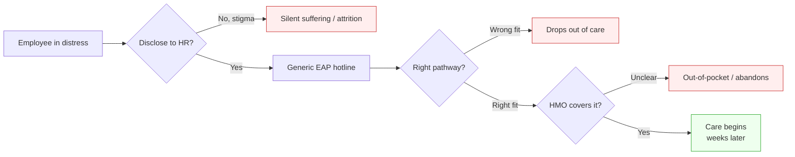
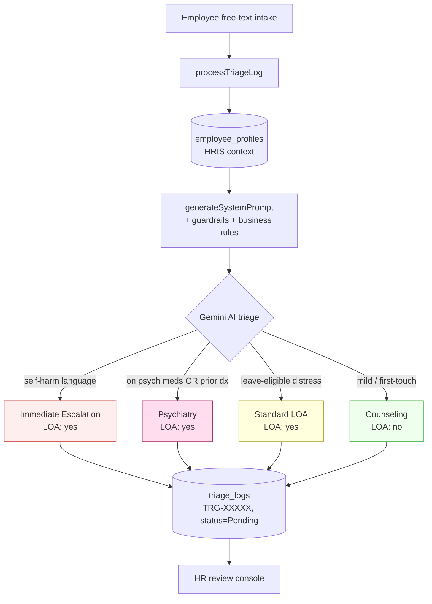
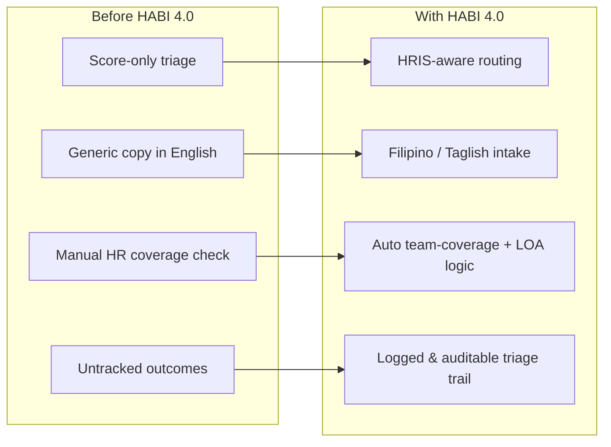

# HABI 4.0

An HR-aware mental wellness assistant for the workplace. HABI 4.0 lets employees describe how they're feeling in their own words (English, Filipino, or Taglish), then routes them to the right care pathway — counseling, psychiatry, leave-of-absence (LOA), or immediate escalation — using their HRIS profile as clinical context.

## Why we built this

Workplace mental health support in the Philippines is often one-size-fits-all: generic EAP hotlines, blanket leave policies, and screening tools (PHQ-9, GAD-7) interpreted without any awareness of the employee's actual job, shift, tenure, language, or HMO coverage.

HABI 4.0 closes that gap. The same PHQ-9 score means very different things for a probationary night-shift agent on antidepressants versus a long-tenured day-shift manager with no clinical history. Our system encodes that context as guardrails so the AI never recommends a counseling-only pathway to someone with prior MDD, never routes a medicated employee to non-psychiatric care, and never silently approves leave that breaches team coverage or probationary entitlements.

The goal is simple: get every employee to the right kind of help, faster, in a language they actually think in, without forcing HR to build a separate triage workflow for every edge case.

## The problem in numbers

Indicative figures sourced from DOH, WHO-SEARO, and Philippine workplace mental-health reports. Used here to frame scope, not as clinical statistics.

```
Filipino adults with a mental health condition (~3.6M)
███████████████░░░░░░░░░░░░░░░░░░░░░░░░░░░░░░░░░░  ~6% of pop.

Workers reporting burnout symptoms in last 12 months
████████████████████████████████████░░░░░░░░░░░░░  ~70%

Employees who never disclose mental health to HR
██████████████████████████████████░░░░░░░░░░░░░░░  ~65%

PH psychiatrists per 100,000 people
█░░░░░░░░░░░░░░░░░░░░░░░░░░░░░░░░░░░░░░░░░░░░░░░░  ~0.5

Avg. wait for first consult (urban) ───────────  2–6 weeks
Avg. wait for first consult (provincial) ──────  6–12 weeks
```

### Where current workplace triage breaks



Three failure modes — non-disclosure, wrong pathway, coverage friction — are exactly what HABI 4.0 collapses into a single context-aware intake.

## What it does

- **Free-text intake.** Employee opens the app and types what they're going through. No forced forms, no required scores.
- **HRIS-aware AI triage.** A Gemini-backed Supabase Edge Function generates a system prompt enriched with the employee's HRIS profile (employment status, leave balances, shift, tenure, HMO, prior diagnoses, current medication, hospitalization history, lifestyle stressors).
- **Pathway routing.** AI returns one of four pathways: `Counseling`, `Psychiatry`, `Immediate Escalation`, or `Standard LOA`, plus a human-readable reasoning and the policy basis behind it.
- **Clinical guardrails (hard overrides).**
  - Self-harm / suicide language → immediate escalation.
  - Active psychiatric medication → psychiatry, never counseling-only.
  - Prior MDD / bipolar / anxiety diagnosis → no counseling-only routing.
  - Previous psychiatric hospitalization → forced higher-severity triage regardless of PHQ-9.
- **Business rule enforcement.**
  - LOA logic checks remaining sick + wellness leave and probationary vs regular entitlements before any auto-approval.
  - Team-coverage check prevents simultaneous absences from the same team.
  - HMO matching surfaces likely-covered clinics and flags uncertain coverage instead of fabricating it.
- **Context-aware scoring.** PHQ-9 sleep items reweighted for night-shift baselines; GAD-7 worry items weighted against financial stress; severity thresholds interpreted by age group and sex at birth.
- **Triage logging.** Every triage produces a reference number (`TRG-XXXXX`) and a `triage_logs` row with status (`Pending`, `Reviewed`, `Escalated`, `Resolved`) for HR review.
- **Filipino-first UX.** Onboarding and triage prompts adapt to the employee's primary language; copy mixes English and Tagalog naturally.

## Tech stack

| Layer | Stack |
|---|---|
| Mobile / Web | Expo (SDK 54), React Native 0.81, React 19, React Navigation 7 |
| Styling | NativeWind 4 (Tailwind 3) + Plus Jakarta Sans |
| Backend | Supabase (Postgres + Auth + Edge Functions on Deno) |
| AI | Google Gemini 1.5 Flash via Supabase Edge Function |
| Language | TypeScript 5.9 |

## Project structure

```
App.tsx                        # entry, fonts, navigation root
navigation/
  RootNavigator.tsx            # Loading → Login → Onboarding → MainTabs
  MainTabs.tsx                 # Home / Notifications / Schedule / Profile
screens/
  LoginScreen.tsx
  LoadingScreen.tsx
  DashboardScreen.tsx
  NotificationsScreen.tsx
  ScheduleScreen.tsx
  ProfileScreen.tsx
  onboarding/                  # Arrival → Identity → ProfileContext → HealthContext → Ready
services/
  aiPromptService.ts           # builds HRIS-aware system prompt
  triageService.ts             # processTriageLog: profile + AI call + DB insert
types/
  hris.ts                      # EmployeeProfile schema
  triage.ts                    # TriageLog, AITriagePathway
lib/supabase.ts                # Supabase client (AsyncStorage-persisted session)
supabase/functions/
  ai-assistantcopy/index.ts    # Deno edge function calling Gemini
components/                    # Button, Card, Input, ProgressBar
```

## Data model

`employee_profiles` (HRIS) — see `types/hris.ts`. Fields cover employment, leave balances, shift, tenure, HMO, age, sex at birth, primary language, job function, baseline sleep, physical conditions, prior diagnoses, current psychiatric medication, hospitalization history, therapy history, plus optional lifestyle context (living situation, financial stress, recent life events, substance use).

`triage_logs` — see `types/triage.ts`. One row per triage event: free-text input, optional PHQ-9/GAD-7 scores, AI pathway, LOA recommendation, AI reasoning, policy basis, reference number, status.

## Getting started

### Prerequisites

- Node 20+
- Expo CLI (`npx expo`)
- A Supabase project (URL + anon key)
- A Google Gemini API key (for the edge function)

### Install

```bash
npm install
```

### Environment

Create `.env` in the project root:

```
EXPO_PUBLIC_SUPABASE_URL=https://<your-project>.supabase.co
EXPO_PUBLIC_SUPABASE_ANON_KEY=<your-anon-key>
```

For the edge function, set the Gemini key as a Supabase secret:

```bash
supabase secrets set GEMINI_API_KEY=<your-gemini-key>
```

### Run

```bash
npm start           # Expo dev server
npm run android     # Android
npm run ios         # iOS
npm run web         # Web
```

### Deploy the edge function

```bash
supabase functions deploy ai-assistantcopy
```

## Triage flow (visual)



### Pathway distribution (illustrative target mix)

```
Counseling             ████████████████████████████████░░░░  ~55%
Standard LOA           ████████████████░░░░░░░░░░░░░░░░░░░░  ~25%
Psychiatry             ██████████░░░░░░░░░░░░░░░░░░░░░░░░░░  ~15%
Immediate Escalation   ███░░░░░░░░░░░░░░░░░░░░░░░░░░░░░░░░░   ~5%
```

### How HRIS context reshapes a single PHQ-9 score

```
Same PHQ-9 = 14 (moderate depression), four employees:

Probationary · night shift · on SSRIs       → Psychiatry + LOA review
Regular · day shift · prior MDD             → Psychiatry (no counseling-only)
Regular · day shift · no clinical history   → Counseling
Any profile · "I want to end it" in text    → Immediate Escalation (override)
```

Score alone routes everyone the same way. HRIS context routes them correctly.

## What HABI 4.0 contributes



### Estimated impact (design targets)

```
Time-to-correct-pathway    ▼ from days  → minutes
Misrouted-to-counseling    ▼ ~70% expected reduction (med/dx-based overrides)
Disclosure rate            ▲ Filipino-first intake lowers stigma friction
HR review load             ▼ guardrails resolve clear-cut cases automatically
Audit trail completeness   ▲ 100% of triages logged with reasoning + policy basis
```

### Stakeholder value

| Stakeholder | What they get |
|---|---|
| Employee | Faster, language-native, stigma-light path to the right care |
| HR | Pre-triaged queue with reasoning, policy basis, and team-coverage awareness |
| Clinical partners | Pre-routed cases matched to HMO coverage and severity |
| Leadership | Aggregate signal on workforce wellness without exposing individuals |

## Triage flow (developer view)

1. User submits free text on the app.
2. `processTriageLog(userId, userInput)` (`services/triageService.ts`):
   - Loads the employee profile from `employee_profiles`.
   - Calls `generateSystemPrompt(profile)` to build an HRIS-enriched system prompt with all clinical guardrails and business rules baked in.
   - Sends the prompt + user message to the AI (currently a deterministic mock with hard overrides for self-harm and active psychiatric medication; production wires through to the `ai-assistantcopy` Gemini edge function).
   - Inserts the result into `triage_logs` with a generated `TRG-XXXXX` reference number and `Pending` status.
3. HR reviews pending entries and updates status (`Reviewed` / `Escalated` / `Resolved`).

## Roadmap

- Wire `triageService` directly to the `ai-assistantcopy` edge function (replace mock).
- Add structured PHQ-9 / GAD-7 capture screens.
- HR review console for `triage_logs`.
- Notifications for follow-ups and escalations.
- Schedule integration for LOA approvals and clinic bookings.

## License

Internal / proprietary. Not for redistribution.
